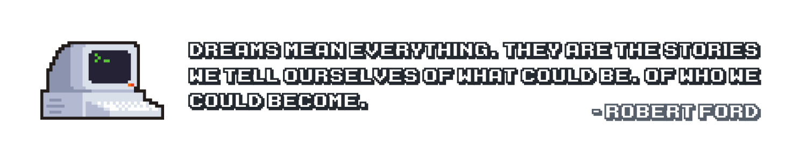

## Welcome To My Profile &nbsp;

Motivated and curious incoming software developer with a keen interest in machine learning, virtual reality, and new technologies. A lifelong tinkerer, I can often be found working on various side projects of mine.
 

## Favourite Technologies &nbsp;

Proficient in a wide range of modern computer programming languages. I am able to meet the novel and challenging demands of today's ever evolving workforce.

<code></code>
<code></code>
<code></code>
<code></code>
<code></code>
<code></code>
 
<code></code>
<code></code>
<code></code>
<code></code>
<code></code>
<code></code>
 

## Let's Chat Over Lunch &nbsp;

Cheerful and friendly, I am always thrilled to meet new friends. Passionate in all things technology related, I enjoy discussing the latest in software and hardware advancements – feel free to reach out to me anytime!

