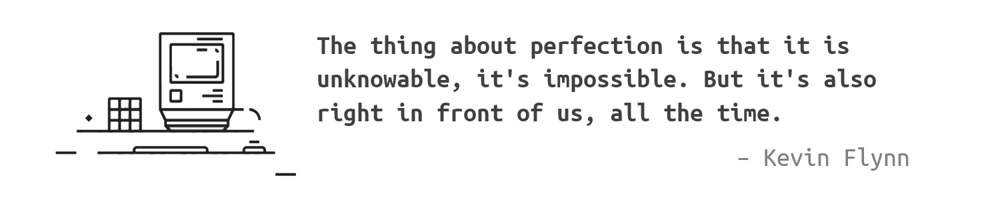

# Hello World

## Welcome to my profile :wave:

Nice to meet you. We don't get a lot of visitors around here. Allow me to introduce myself, I'm Alan. I'm a software developer who mainly focuses around building consumer facing web and mobile products. In particular, I am very interested in solving UI and UX problems. In my free time, I like to read science fiction novels and play board games.

## My favorite tool sets :computer:

Although I have experience using a wide range of odd tools, my weapon of choice is Python. A former champion of PHP, I became disillusioned when it betrayed me and abandoned me in Unicode hell. Because of this incident, I ended up learning Python. Nowadays, I use Python for almost everything, from the smallest scripts to the largest projects.

<code></code>
<code></code>
<code></code>
<code></code>
<code></code>
